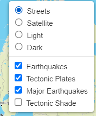
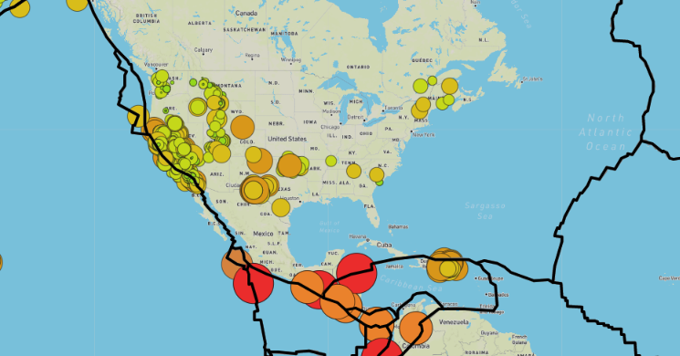
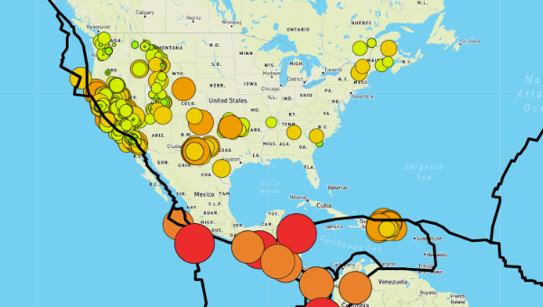
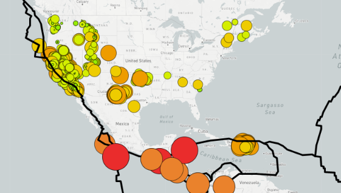
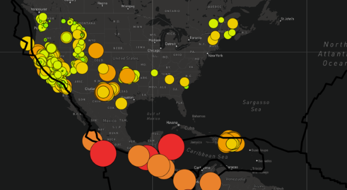
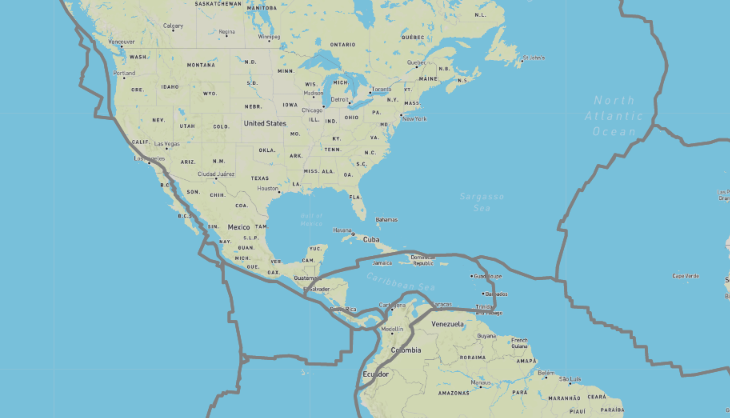

# Mapping_Earthquakes

## Overview
Creating a map to see the earthquake data in relation to the tectonic plates’ location on the earth, and the earthquakes with a magnitude greater than 4.5 on the map. 

 The picture belows shows what is on the top right hand corner, we can see all the different layers that we choose from.  

  

## Results 

The map shown below is the original map one would see when the link is open. As we can see, all of the layers are shown on the "street" view. 

  
   <i>Map 1: Original Map</i>  

For all the different maps, see below and the description of which layers are applied to each of them: 

  
   <i>Map 2: Street Map with Earthquake, Tectonic Plates and Major Earthquakes</i>  

  

  
   <i>Map 3: Street Map with Earthquake, Tectonic Plates and Major Earthquakes</i>  

  

  
   <i>Map 4: Light Map with Earthquake, Tectonic Plates and Major Earthquakes</i>  

  

  

  
   <i>Map 5: Dark Map with Earthquake, Tectonic Plates and Major Earthquakes</i>  

  

  

  
   <i>Map 6: Tectonic Plates on Street Map</i>  

  

  

From all of these maps, it is shown very clearly that most of the Earthqakes and Major Earthquakes are on the boundary of the Tectonic Plates. 

  

